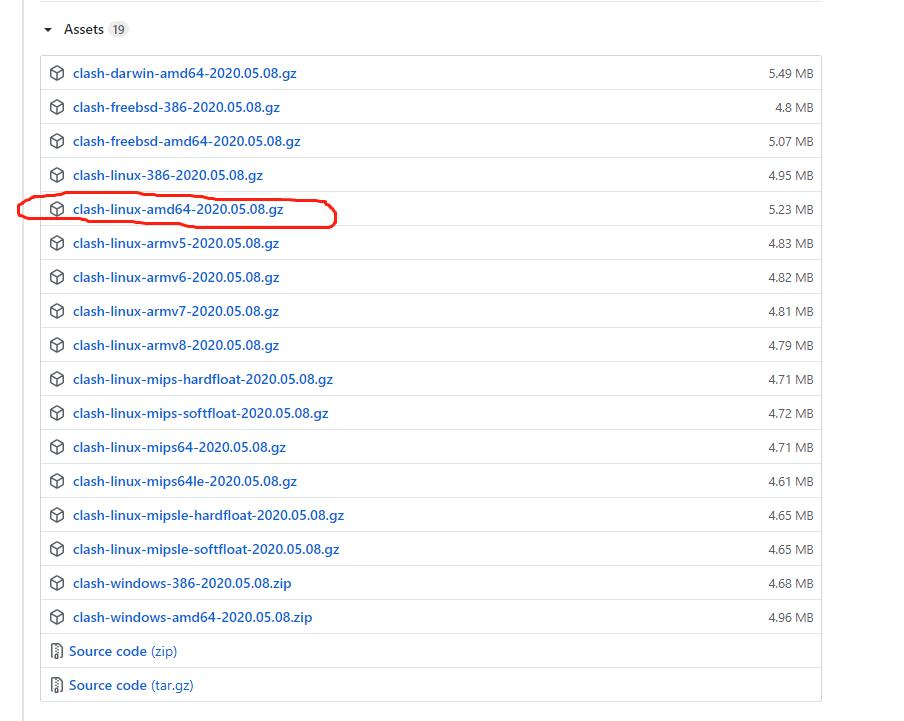
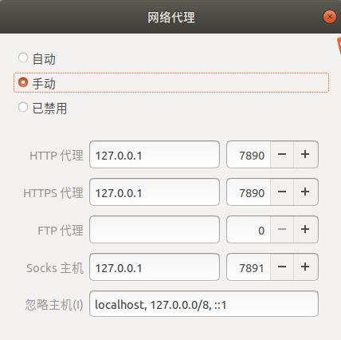

### 下载linux-amd64的版本




````
sudo gunzip ***.gz


chmod +x clash***


./clash***

clash会自动在~/.config/下创建clash文件夹，里面有config.yaml 与Country.mmdb 2个文件，config.yaml 为空文件，Country.mmdb为正在下载的文件，等待Country.mmdb下载完成之后关闭clash程序，将config.yaml 替换为自己的托管文件。这个文件一般的商家会提供，如果没有，就按以下命令创建


sudo curl  Clash托管链接   >>  config.yaml
````




```

运行clash

./clash***

打开网站
http://clash.razord.top/
```

